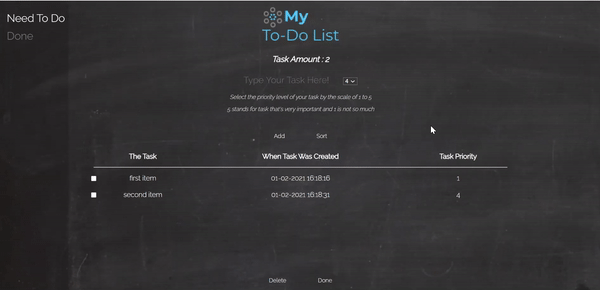
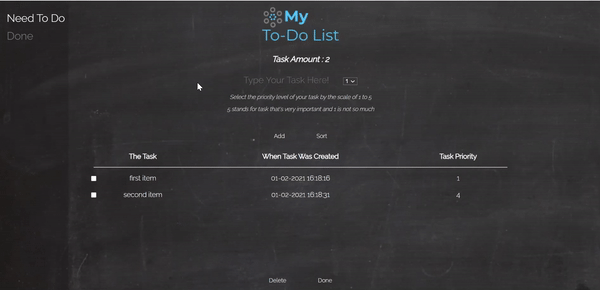
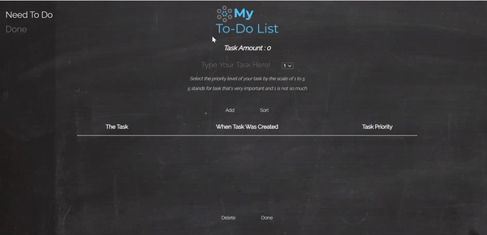
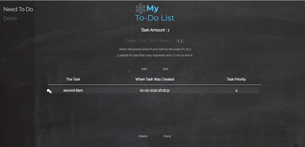

#  Pre Course Project - Todo List 📋

## Introduction

In this website you can manage your tasks in much simpler way!
All you need to do is insert task, pick the priority of the task, and click ENTER key or on the add button!

## Manage Your Way Threw The Site

### Sort Button

The items will be added be the order of creation, but if you like to sort by priority all you need to do is click on the sort button.

### Done Button

After finishing a task, you can mark the task and click the "Done" button.
The task will go to the "Done" section and you could check your done tasks there.

### Done section

In the "Done" section you can see the tasks you finished and delete them if you wish.
The logo on the top off the page will be different and the "Done" section on the Nav-Bar will be bold so you could tell the difference.

### Delete button

In the main page, you can check items you wish to delete, and after clicking the "Delete" button the will be gone forever.
Its recommended to use the delete button only on tasks you added unintentionally.

## Some Fun Facts

- The site will save the items you added no matter where you will open it!
- ENTER Key will insert your item as same as the "Add" button does!
- Your Tasks will be saved also on your Local Storage so you don't need to be afraid about the list will be lost!

## Bonus Features

- JsonBin storage added
- Two fetch functions, one for the items and one for the done page
- Loading spinner while network request
- Enter key to add item
- Self Design logo for the page
- Another page for done tasks
- Not allowing delete or adding task if not checked or adding text
- Using BOTH jsonbin and localstorage to make the content load fester

## About me

Hello! me name if Ofir Danan and I hope you will enjoy my website!
You can find me here:

- GitHub - [My GitHub Profile](https://github.com/ofir-danan)
- Email - ofirid98@gmail.com
- Phone Number - 052-2949223

## Ze Ani

- Introductory Video - [Introductory-video](https://drive.google.com/file/d/1h-Q-SuLtWncJ_EQEgep7L8ubCR6gwh8k/view?usp=sharing)
